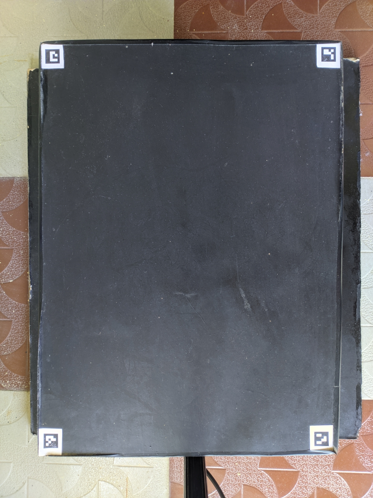
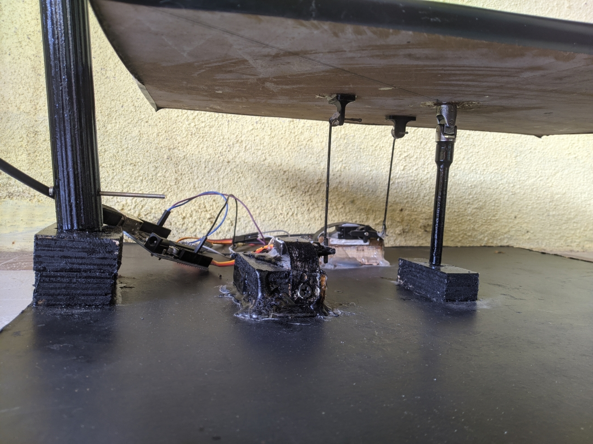

# **Ball-Balancing-PID-System**
This project consists in the realization of a Ball-Plate system with 2 degree of freedom which will control the position of the ball by tilting the plate.

* Two servomotors will allow the table to be oriented with a certain angle of inclination to counterbalance the movements of the ball.

* A Pi camera placed above the device will feed live images of the plate to a Raspberry PI 4B.

* A Python program will then be responsible for processing these images, analyzing them to draw conclusions such as the position of the ball, its speed and acceleration.

* Then it is feed to PID controller and transmitting the result by USB to the Arduino which will control the rotation of both servos independently.

* All the data will be sent to the Python program running in another computer using MQTT protocol. And the results would be plotted.

## Team members:
* Amoghavarsha S G
* Niranjana Jois H C
* Kiran C N

## Block Diagram

## Requirements
* **Hardware**
  * Raspberry Pi 4B
  * Pi Camera
  * PC
  * Arduino
  * 2 Servo motors
  * Universal Joint
  * 2 Push rods
* **Software**
  * **On both Raspberry Pi and PC**
    * opencv-contrib-python
    * numpy
    * json
    * paho_mqtt
    * threading
  * **On Raspberry PI**
    * pyserial
    * mosquitto broker
  * **On PC** 
    * pyqtgraph
    * Qt5

## Setting up
* **Raspberry pi**
  * Install raspberry pi os.
  * Install mosquitto broker on your Raspberry PI.
    * `sudo apt install mosquitto`
  * Install all the python packages mentioned above.
  * git clone this repositiory
  * we only need on-pi directory files here

* **Arduino**
  * Clone this repository on PC
  * Upload the on-arduino.ino file in on-arduino directory to the Arduino.
  * By default pin 5 is for X-axis servo and 6 for Y-axis servo.

* **PC**
  * Go to interface-on-pc directory
  * run `startInterface.sh` if on linux or `startInterface.bat` if on windows
  * Interface Image

    

* **Table**
  * Table Image

    

  * Aruco Marker order (aruco.DICT_4X4_50)
    * Top left:     ID 0
    * Top Right:    ID 1
    * Bottom Right: ID 2
    * Bottom Left:  ID 3
  * You can change the ID's or their order. If you do, then:
    * In `on-pi/main.py` change the list `aruco_marker_order` in order mentioned above.

* **Servo Motors**
  * Servo Placement

    

  * Distance from centre to both x and y axis servo: `8cm`

* **Raspberry Pi and Pi Camera**

  

* **Overall Structure**

  
